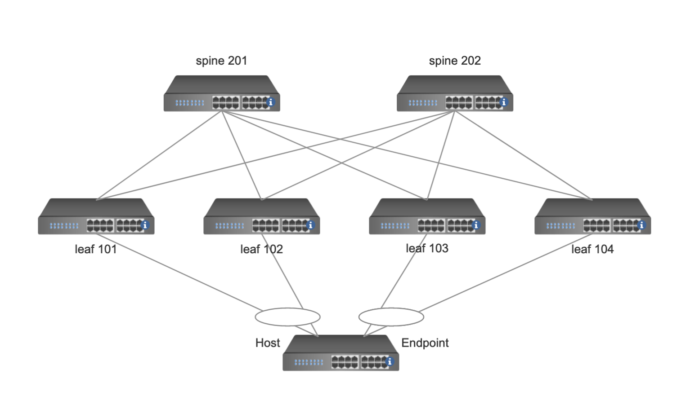

# Terraform with Cisco ACI Demo
This ACI configuration uses Terraform to create a tenant, VRF, bridge domain, application profile, EPG, L3Out and contract to enable communication between a host and a L3Out across an ACI fabric. In the topology, traffic flows from the "host" to the L3Out "endpoint" through 2 VPCs and spine switches. 
<p align="center">

</p>

## ACI Tenant Object Hierarchy
```
Tenant
|_ AP
  |_ EPG
    | Physical Domain
    | Static Ports
    | Provided Contract
    
|_ Bridge Domain
  | Subnet (public)
  | L3Out
  
| VRF

|_ L3Out (OSPF)
  |_ Logical Node Profile
    | Logical Interface Profile
  |_ External EPG
    | Consumed Contract
```
